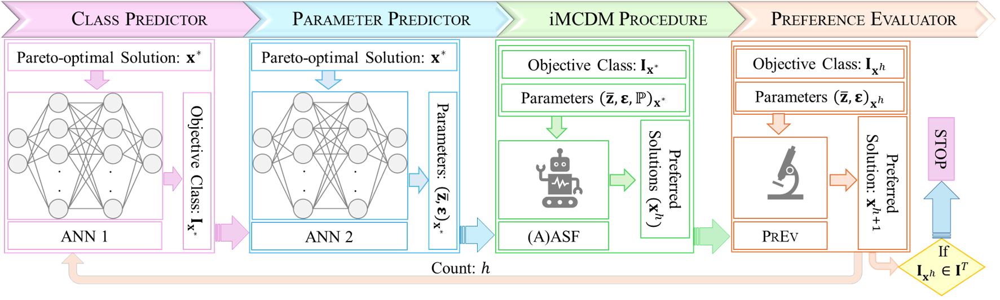

# **pyMachDM: Machine Learning-Based Decision-Makers in Python**

  
  

---

## 🏷️ **About**

**pyMachDM** is an open-source Python package that benchmarks interactive multi-criteria decision-making (iMCDM) methods by simulating human preferences using machine learning-based decision makers (Machine-DM).

**`pip install pyMachDM`**

---

## 🔭 **Big Picture**

{ width="850"}

**Fig. Outline of Machine Learning-Based Decision-Makers**

---

## 🔔 **News and Updates**

Furthermore, our framework offers a variety of different features which cover various facets of benchmarking iMCDM methods:

-   📢 **Announcement** 

    ---

    { width="50"} Release of **pyMachDM** 

    
    
    
  

   

-   [💻 **Interface**](home/quickstart.md)

    ---

    Main entry point function to run your Machine-DM:
    
    * **`machine_dm`**

---

## ⚠️ **Disclaimer**

 We acknowledge that:
 
- Human decision-making cannot be fully replicated by Machine-DM
- The primary goal is to enable systematic benchmarking of iMCDM methods
- The framework provides a digital platform for interactive MCDM research and development
- We hope to facilitate the design of more effective iMCDM methods for real-world use

