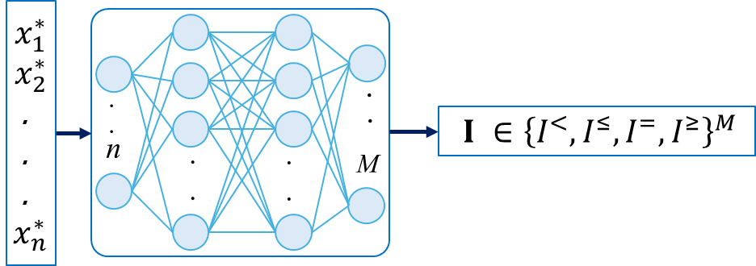
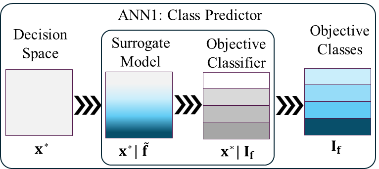

### Defining Objective Class

----

### Data Preperation

----

### **Training ANN1: $\mathcal{F}_{CL}$**

Class Predictor ML ($\mathcal{F}_{CL}$) takes Pareto-optimal solution $(\mathbf{x}^*)$ as input and predicts the objective class $\mathbf{I}$.

----
{ width="450"}

**Fig. Training Class Predictor ML ($\mathcal{F}_{CL}$)**

----

* $\mathcal{F}_{CL}: {\mathbf{x}^*}^{[1 \times n]} \overset{\mathcal{F}_{CL}}{\longrightarrow} \mathbf{I}^{[1 \times M]}$
 
* $\quad \mathbf{I} \in \{I^{<}, I^{\leq}, I^{=}, I^{\diamond}\}$

----
{ width="400"}

**Fig. Class Predictor ML ($\mathcal{F}_{CL}$) as surrogate model and classifier**

----

### ANN1 Architecture

