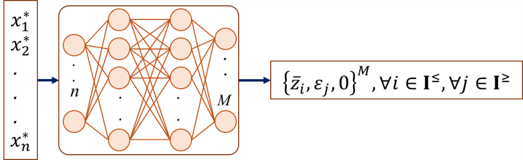
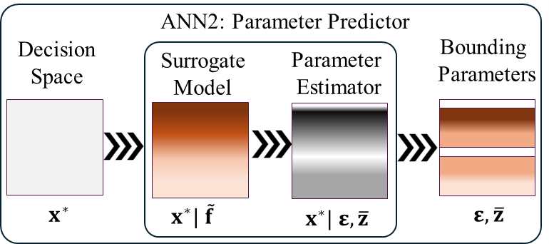

### Defining Bounding Parameters

### Data Preperation 

### **Training ANN2: $\mathcal{F}_{PP}$**

Parameter Predictor ML ($\mathcal{F}_{PP}$) takes Pareto-optimal solution $(\mathbf{x}^*)$ as input and predicts the bounding parameters $(\bar{z}, \varepsilon)$.

----
{ width="450"}

**Fig. Training Parameter Predictor ML ($\mathcal{F}_{PP}$)**

----

* $\mathcal{F}_{PL}: {\mathbf{x}^*}^{[1 \times n]} \overset{\mathcal{F}_{CL}}{\longrightarrow} (\bar{z}_i, \varepsilon_j, 0)^{[1 \times M]}$
 
* $\quad i \in I^{\leq}, j \in I^{\geq}, ~\text{and}~ 0 \in \{I^<, I^{=}\}$

----
{ width="400"}

**Fig. Parameter Predictor ML ($\mathcal{F}_{PP}$) as surrogate model and classifier**

### ANN2 Architecture

